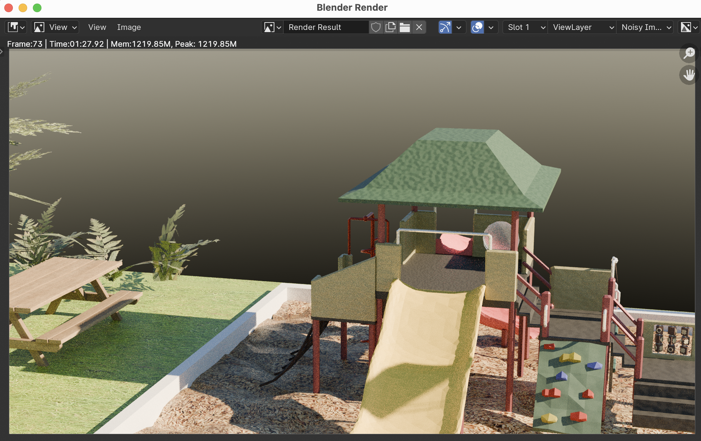
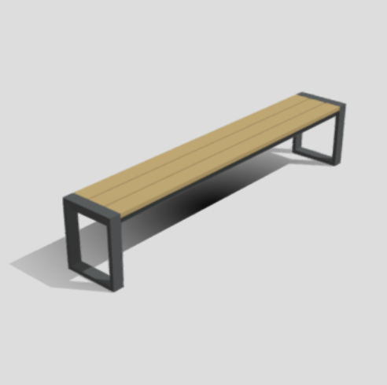
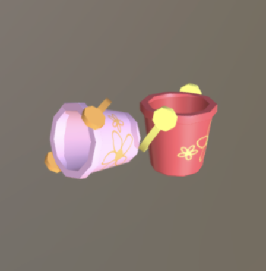
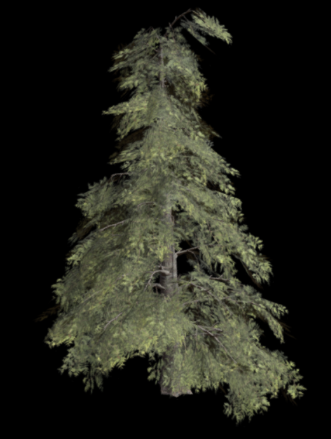
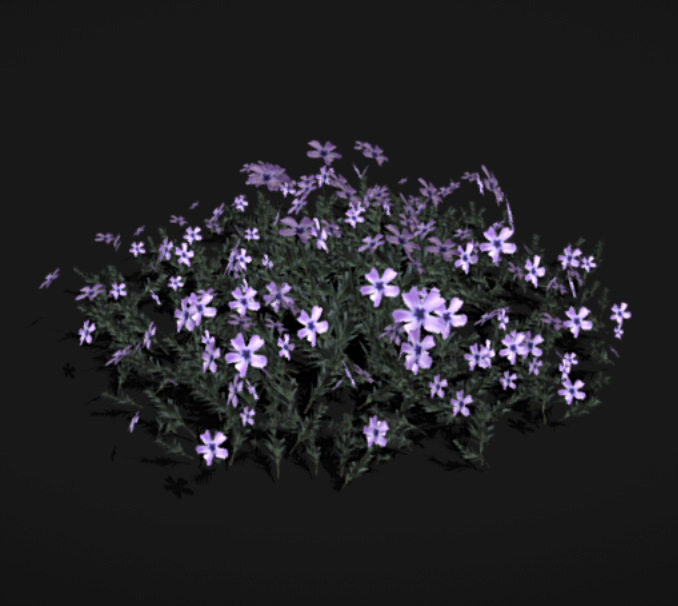
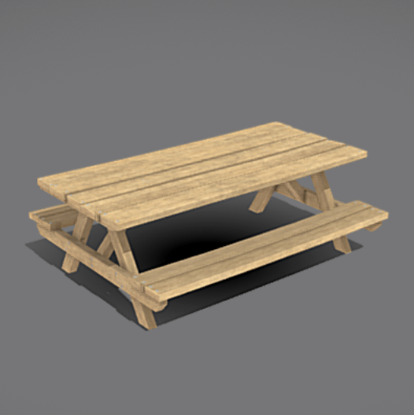
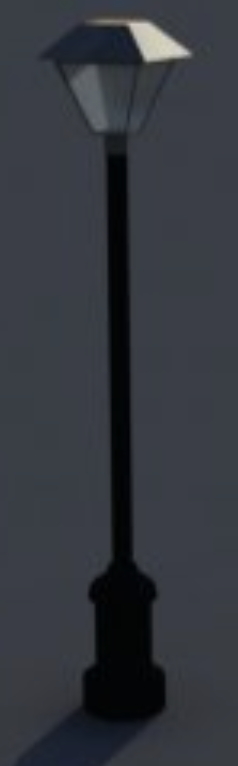

## Late-night July 🛝🎆
Fireworks & a playground. Made with Blender, THREE.js, and A-FRAME over about a week. 

This is my submission for the [Frappucino hackathon](https://hackaccino.hackclub.com/) of 
[hack club](https://hackclub.com) 😋

## Notes

Models not listed at the bottom are OC, namely the playground lol.

I had to bake lighting onto the playground because I can't really set up a good shader inside of A-FRAME unfortunately. If you have blender installed, you're welcome to go look around original file with cycles rendering engine. It's the full_scene.glb

To change the **SUN** position, go to `Layout` mode, then you should see a view in the bottom right with a lot of tabs. Click the red earth button (`World settings`) and now you can change the `Sun elevation` in degrees !

## License ?
just ask me to use the model cuz it took a while to make
I won't like sue you if you do steal it without asking, but I will be very sad and lose faith in humanity

## Credits for other models 📦
usage under CC license:
https://creativecommons.org/licenses/by/4.0/

| Img | Thing | User | Link | 
|-----|-------|------|------|
|  | low poly bench | @JustBlender | [Sketchfab](https://sketchfab.com/3d-models/low-poly-bench-3-4408281074eb4c30afafd96c7c421193) |
|  | beach buckets | @kyanaa | [Sketchfab](https://sketchfab.com/3d-models/beach-buckets-db3bb3d41e934947b65d952bdc4e5280) |
|  | conifer tree | @Sereib | [Sketchfab](https://sketchfab.com/3d-models/conifer-medium-poly-38fb9cc46832422fb9bded278134ad83) |
|  | blanket phlox | @E.A.Cornell | [Sketchfab](https://sketchfab.com/3d-models/blanket-phlox-69bf5e21f767419dafec910f7a6be799) |
|  | picnic table | @MaX3Dd | [Sketchfab](https://sketchfab.com/3d-models/picnic-table-low-poly-0781d9085e764583bc0a61f26cd4d01e) |
|  | lamp posts | @bazsa | [Free3D](https://free3d.com/3d-model/street-lamp-40556.html) |